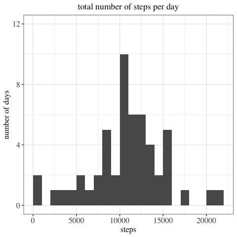
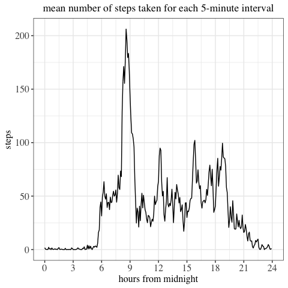
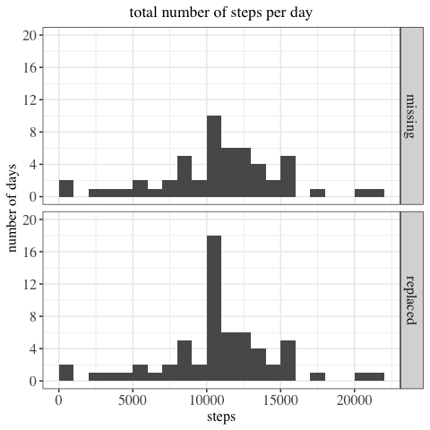
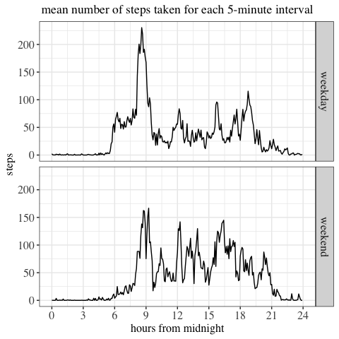

#### Background
This report answers the questions posed in the first course assignment in the 
reproducible research course, part of the Data Science specialistion from
John Hopkins University which can be found at coursera.com

This report answers a series of questions about an individuals personal activity. The individuals personal activiy was measured using a personal activity monitoring device. The device collects data at 5 minute intervals through out the day. The data consists of two months of data from an anonymous individual collected between 1st October and 30th November, 2012 and include the number of steps taken in 5 minute intervals each day.

#### Analysis

Reading in the data and storing it in a data frame, "dat".

```r
url <- "https://d396qusza40orc.cloudfront.net/repdata%2Fdata%2Factivity.zip"

library(downloader)

if(!(file.exists("activity.csv"))){
        download(url, "./activity.zip")
        unzip("activity.zip",exdir = "./")
        unlink("activity.zip")}
dat <- read.csv("activity.csv", sep = ",")
```

Taking a look at the structure of the data frame.


```r
str(dat)
```

```
## 'data.frame':	17568 obs. of  3 variables:
##  $ steps   : int  NA NA NA NA NA NA NA NA NA NA ...
##  $ date    : chr  "2012-10-01" "2012-10-01" "2012-10-01" "2012-10-01" ...
##  $ interval: int  0 5 10 15 20 25 30 35 40 45 ...
```

The date and interval variables require a class change: 

* date from character class to date format
* interval would be better expressed in hours, minutes, seconds using period class.


```r
library(lubridate)
library(stringr)
dat$interval <- str_pad(as.character(dat$interval), width=4, side="left", pad="0")

dat$interval <- hours(substr(dat$interval,start = 1, stop = 2)) + 
        minutes(substr(dat$interval,start = 3, stop =4))

dat$date <- ymd(dat$date)
```

Checking the structure of the variables again reveals that the class changes
have been successful and now the data set is in a good format for analysis.


```r
str(dat)
```

```
## 'data.frame':	17568 obs. of  3 variables:
##  $ steps   : int  NA NA NA NA NA NA NA NA NA NA ...
##  $ date    : Date, format: "2012-10-01" "2012-10-01" ...
##  $ interval:Formal class 'Period' [package "lubridate"] with 6 slots
##   .. ..@ .Data : num  0 0 0 0 0 0 0 0 0 0 ...
##   .. ..@ year  : num  0 0 0 0 0 0 0 0 0 0 ...
##   .. ..@ month : num  0 0 0 0 0 0 0 0 0 0 ...
##   .. ..@ day   : num  0 0 0 0 0 0 0 0 0 0 ...
##   .. ..@ hour  : num  0 0 0 0 0 0 0 0 0 0 ...
##   .. ..@ minute: num  0 5 10 15 20 25 30 35 40 45 ...
```

#### What is mean total number of steps taken per day?
Note: for this part of the assignment, the missing values in the dataset are ignored.
The distribution of the total number of steps taken per day can be observed in 
the histogram below. The histogram shows the modal class interval is 10000-11000 steps.   


```r
library(dplyr)
library(ggplot2)
stepday <- dat %>%
        group_by(date) %>%
        summarise(totalsteps = sum(steps))

ggplot(data = stepday, aes(totalsteps)) +
        geom_histogram(binwidth = 1000,boundary = 0, closed = "right") +
        scale_y_continuous(limits = c(0,12), 
                         breaks = seq(0,12,4),
                         minor_breaks = seq(0,12,2)) +
        labs(x= "steps", y ="number of days", 
        title = "total number of steps per day") +
        theme_bw(base_family = "Times") +
        theme(plot.title = element_text(hjust=0.5)) +
        theme(strip.text.y = element_text(size = 12),
              axis.text = element_text(size = 12),
              axis.title = element_text(size =12))
```

<!-- -->

```r
options(scipen = 999)
meanstep <- signif(mean(stepday$totalsteps,na.rm = TRUE),digits = 5)
medianstep <- signif(median(stepday$totalsteps, na.rm = TRUE), digits =5)
```
The mean total number of steps taken per day is 10766 and the median is 10765.

#### What is the average daily activity pattern?

The time series plot shows the mean number of steps taken averaged across all days (y-axis) for each 5-minute interval (x-axis). The plot shows that the intervals with the largest average number of steps are between 8am and 9am. 


```r
intmean <-   dat %>% 
        group_by(interval) %>%
        summarise(meansteps = mean(steps,na.rm = TRUE))

ggplot(data = intmean, aes(x= as.numeric(interval)/3600, y= meansteps)) +
        scale_x_continuous(breaks = seq(0,24,3), limits = c(0,24)) +
        geom_line() +
        labs(x = "hours from midnight", y = "steps", 
             title = "mean number of steps taken for each 5-minute interval") +
        theme_bw(base_family = "Times") +
        theme(plot.title = element_text(hjust=0.5)) +
        theme(strip.text.y = element_text(size = 12),
              axis.text = element_text(size = 12),
              axis.title = element_text(size =12))
```

<!-- -->


```r
maxstepint <- intmean[which.max(intmean$meansteps),1] 
maxstep <- signif(intmean[which.max(intmean$meansteps),2],3) 
```

The 5-minute interval 8H 35M 0S contains the maximum number of steps, 206, on average, across all the days in the dataset,

#### Imputing values for the NA's


```r
sumna <- sum(is.na(dat$steps))
meanna <- round(mean(is.na(dat$steps)),3)
```

The total number of missing values in the dataset is 2304 - this is a proportion of 0.131 of the dataset.

The presence of missing days may introduce bias into some calculations or summaries of the data. The mean number of steps taken, averaged across all days for each 5-minute interval will be used to replace the NA's in the original data set, dat. 


```r
datn <- dat

datn$averagesteps <- rep(intmean$meansteps,nrow(datn)/nrow(intmean))

datn$steps[which(is.na(datn$steps))] <-  
        datn$averagesteps[which(is.na(datn$steps))]

datn <- datn[,1:3]
```

The graph below shows that the distribution of the mean total number of steps before after the missing values were replaced. The histograms are identical apart from the bar representing the number of days 10000 to 11000 steps were counted. This indicates that data was missing for 8 complete days only and that the mean total steps 10766 replaces the missing value for those days. 


```r
stepdayn <-     datn %>%
        group_by(date) %>%
        summarise(totalsteps = sum(steps)) %>%
        mutate(stepNA = "replaced")

stepday <- stepday %>%
         mutate(stepNA = "missing")

totsteps <- bind_rows(stepdayn,stepday)
totsteps$stepNA <- as.factor(totsteps$stepNA)

ggplot(data = totsteps, aes(totalsteps)) +
        geom_histogram(binwidth = 1000,boundary = 0, closed = "right") +
        scale_y_continuous(limits = c(0,20), 
                         breaks = seq(0,20,4),
                         minor_breaks = seq(0,20,2)) +
        facet_grid(row = vars(stepNA)) +
        labs(x= "steps", y ="number of days", 
        title = "total number of steps per day") +
        theme_bw(base_family = "Times") +
        theme(plot.title = element_text(hjust=0.5)) +
        theme(strip.text.y = element_text(size = 12),
              axis.text = element_text(size = 12),
              axis.title = element_text(size =12))
```

<!-- -->

The table below compares mean and median total number of steps taken each day with missing values and missing values replaced. The means are equal which confirms that the data was missing for complete days only.


```r
totstepmm <- totsteps %>%
        group_by(stepNA) %>%
        summarise(median = median(totalsteps,na.rm = TRUE), 
                  mean = mean(totalsteps,na.rm = TRUE))
totstepmm
```

```
## # A tibble: 2 x 3
##   stepNA   median   mean
## * <fct>     <dbl>  <dbl>
## 1 missing  10765  10766.
## 2 replaced 10766. 10766.
```

#### Are there differences in activity patterns between weekdays and weekends?

It is interesting to compare the individuals personal activity on a weekday (monday to friday) with their personal activity on the weekend (saturday and sunday).

Below is a the plot of the 5-minute interval (x-axis) and the average number of steps taken, averaged across all weekday days or weekend days (y-axis). 


```r
datn$partweek <- as.character(rep(NA, nrow(datn)))

datn$day <- weekdays(datn$date)

weekday <-c("Monday","Tuesday","Wednesday","Thursday","Friday")
weekend <-c("Saturday","Sunday")

datn$partweek[datn$day %in% weekday] <- "weekday"
datn$partweek[datn$day %in% weekend] <- "weekend"

datn$partweek <- as.factor(datn$partweek)

datn <- datn[,1:4]

intmeanp <-     datn %>% 
        group_by(partweek, interval) %>%
        summarise(meansteps = mean(steps))

ggplot(data = intmeanp, aes(x= as.numeric(interval)/3600, y= meansteps)) +
        geom_line() +
        scale_x_continuous(breaks = seq(0,24,3), limits = c(0,24)) +
        facet_grid(row = vars(partweek)) +
        labs(x = "hours from midnight", y = "steps", 
             title = "mean number of steps taken for each 5-minute interval")+
        theme_bw(base_family = "Times") +
        theme(plot.title = element_text(hjust=0.5)) +
        theme(strip.text.y = element_text(size = 12),
              axis.text = element_text(size = 12),
              axis.title = element_text(size =12))
```

<!-- -->

The plot shows that, in general, the individual is more active, on average, between the hours of 9am and 9pm compared with weekdays and is less active, on average, before 9am on the weekend compared with a weekday.

#### Conclusion
The analysis carried out during this assignment shows that the individuals personal activity level is high with an average of over 10000 steps a day. Furthermore, the individuals activity levels on the weekend and weekday are distinctively different indicating that activies carried out during the week e.g. work are different from those on the weekend e.g. leisure.  
